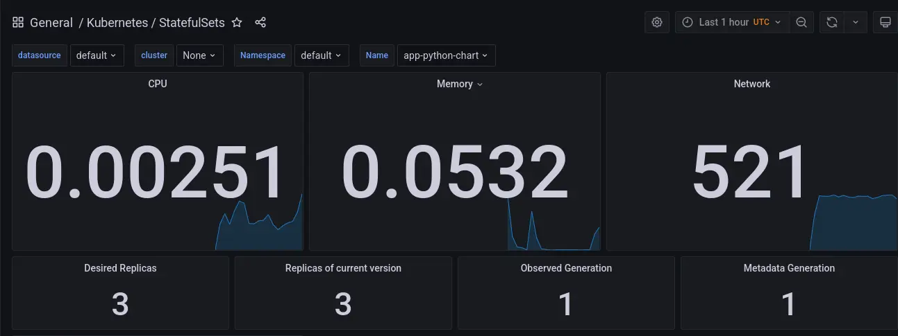

# Kube Prometheus Stack

Kube Prometheus allows for a simplified deployment of Prometheus and related resources in Kubernetes. It contains the following components:

- Prometheus Operator  
  An adapter for Prometheus that leverages the Kubernetes-native components to build the infrastructure that Prometheus requires.
- Prometheus  
  A metrics engine that collects and displays metrics, either natively or through integrations like Grafana.
- Alertmanager  
  Works similarly to Prometheus, but focuses on collecting and forwarding alerts rather than collecting metrics.
- Node Exporter  
  A program that provides metrics from native OS components on the node.
- Prometheus Adapter for Kubernetes Metrics APIs  
  As the name suggests, it bridges together the Kubernetes Metrics API and the Prometheus metrics API.
- kube-state-metrics  
  A service that provides metrics about the Kubernetes cluster as a whole, the managed objects and so on.
- Grafana  
  An extensible and customizable dashboard that integrates with Prometheus to display the metrics to the end user.

```
❭ kubectl get po,sts,svc,pvc,cm
NAME                                                            READY   STATUS              RESTARTS   AGE
pod/app-python-chart-0                                          0/1     Running             0          12s
pod/app-python-chart-1                                          0/1     Running             0          12s
pod/app-python-chart-2                                          0/1     Running             0          12s
pod/kube-prometheus-stack-grafana-5566bcc5b5-sk5fw              0/2     Init:0/1            0          37s
pod/kube-prometheus-stack-kube-state-metrics-7f996bfdc7-ds84t   0/1     ContainerCreating   0          37s
pod/kube-prometheus-stack-operator-5f66cc66bf-wvgpt             0/1     ErrImagePull        0          37s
pod/kube-prometheus-stack-prometheus-node-exporter-zx86k        1/1     Running             0          38s

NAME                                READY   AGE
statefulset.apps/app-python-chart   0/3     12s

NAME                                                     TYPE           CLUSTER-IP       EXTERNAL-IP   PORT(S)        AGE
service/app-python-chart                                 LoadBalancer   10.103.181.81    <pending>     80:30000/TCP   12s
service/kube-prometheus-stack-alertmanager               ClusterIP      10.99.80.223     <none>        9093/TCP       38s
service/kube-prometheus-stack-grafana                    ClusterIP      10.102.213.2     <none>        80/TCP         38s
service/kube-prometheus-stack-kube-state-metrics         ClusterIP      10.109.95.253    <none>        8080/TCP       38s
service/kube-prometheus-stack-operator                   ClusterIP      10.108.153.209   <none>        443/TCP        38s
service/kube-prometheus-stack-prometheus                 ClusterIP      10.97.89.32      <none>        9090/TCP       38s
service/kube-prometheus-stack-prometheus-node-exporter   ClusterIP      10.96.246.230    <none>        9100/TCP       38s
service/kubernetes                                       ClusterIP      10.96.0.1        <none>        443/TCP        7d

NAME                                                   STATUS   VOLUME                                     CAPACITY   ACCESS MODES   STORAGECLASS   AGE
persistentvolumeclaim/data-volume-app-python-chart-0   Bound    pvc-5e1f3cf5-9d35-49d4-8c95-f8e4b86b3e83   1Mi        RWO            standard       33h
persistentvolumeclaim/data-volume-app-python-chart-1   Bound    pvc-151cc1f6-e32b-4f83-9a04-6bd1d6f6845c   1Mi        RWO            standard       33h
persistentvolumeclaim/data-volume-app-python-chart-2   Bound    pvc-bdcaa4d7-905e-4139-8f46-d3f518839f31   1Mi        RWO            standard       33h

NAME                                                                DATA   AGE
configmap/kube-prometheus-stack-alertmanager-overview               1      38s
configmap/kube-prometheus-stack-apiserver                           1      38s
configmap/kube-prometheus-stack-cluster-total                       1      38s
configmap/kube-prometheus-stack-controller-manager                  1      38s
configmap/kube-prometheus-stack-etcd                                1      38s
configmap/kube-prometheus-stack-grafana                             1      38s
configmap/kube-prometheus-stack-grafana-config-dashboards           1      38s
configmap/kube-prometheus-stack-grafana-datasource                  1      38s
configmap/kube-prometheus-stack-grafana-test                        1      38s
configmap/kube-prometheus-stack-k8s-coredns                         1      38s
configmap/kube-prometheus-stack-k8s-resources-cluster               1      38s
configmap/kube-prometheus-stack-k8s-resources-namespace             1      38s
configmap/kube-prometheus-stack-k8s-resources-node                  1      38s
configmap/kube-prometheus-stack-k8s-resources-pod                   1      38s
configmap/kube-prometheus-stack-k8s-resources-workload              1      38s
configmap/kube-prometheus-stack-k8s-resources-workloads-namespace   1      38s
configmap/kube-prometheus-stack-kubelet                             1      38s
configmap/kube-prometheus-stack-namespace-by-pod                    1      38s
configmap/kube-prometheus-stack-namespace-by-workload               1      38s
configmap/kube-prometheus-stack-node-cluster-rsrc-use               1      38s
configmap/kube-prometheus-stack-node-rsrc-use                       1      38s
configmap/kube-prometheus-stack-nodes                               1      38s
configmap/kube-prometheus-stack-persistentvolumesusage              1      38s
configmap/kube-prometheus-stack-pod-total                           1      38s
configmap/kube-prometheus-stack-prometheus                          1      38s
configmap/kube-prometheus-stack-proxy                               1      38s
configmap/kube-prometheus-stack-scheduler                           1      38s
configmap/kube-prometheus-stack-statefulset                         1      38s
configmap/kube-prometheus-stack-workload-total                      1      38s
configmap/kube-root-ca.crt                                          1      7d
```

## Answers to questions

> How much CPU and Memory your StatefulSet is consuming?



According to the _General/Kubernetes/StatefulSets_ dashboard, my stateful set is consuming **0.00251 CPU units** and **0.0532 GB of memory**.

> Which Pod is using CPU more than others and which is less in the default namespace?


According to the _General/Kubernetes/Compute Resources/Node (Pods)_ dashboard, the _CPU Quota_ view, ordered by CPU usage descending, **the most CPU-intensive pod is `kube-apiserver-minikube`** and **the least CPU-intensive pod is `app-python-chart-1`**.

> How much memory is used on your node, in % and mb?


According to the _General/Node Exporter/Nodes_ dashboard, the **memory usage is 1.27 GiB (1300 MiB)** and 766 MiB is cached, so the **overall memory usage is 96%**.

> How many pods and containers actually ran by the Kubelet service?


According to the _General/Kubernetes/Kubelet_ dashboard, Kubelet is running **16 pods** and **34 containers**.

> Which Pod is using network more than others and which is less in the default namespace?


According to the _General/Kubernetes/Compute Resources/Namespace (Pods)_ dashboard, the _Current Network Usage_ view, ordered by Current Receive Bandwidth descending, **the most network-intensive pod is `prometheus-kube-prometheus-stack-prometheus-0`** and **the least network-intensive pod is `app-python-chart-0`**.

> How many alerts do you have?


According to the _General/Alertmanager/Overview_ dashboard, **the current amount alerts is 9**.
