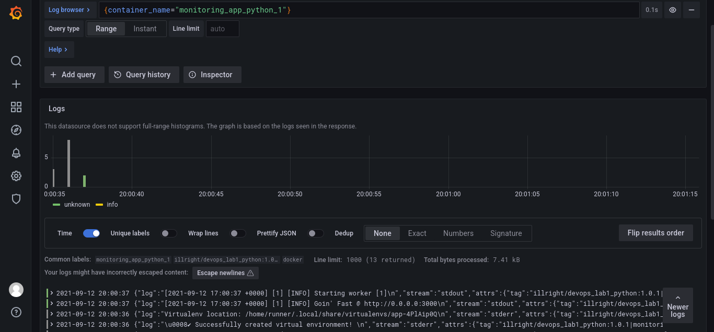
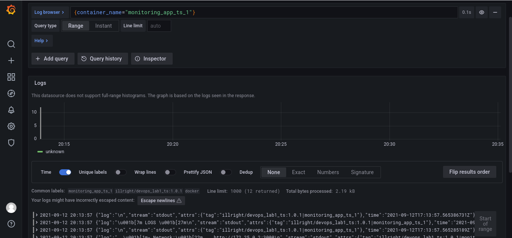
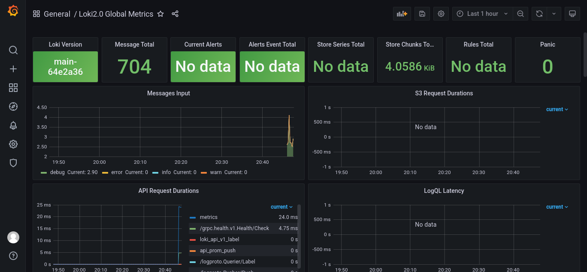
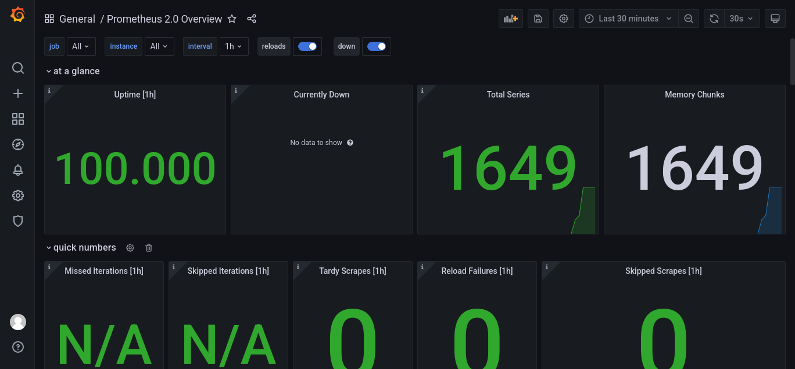
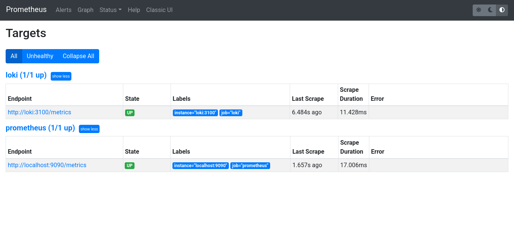

# Report on setting up the logging stack

I've successfully set up Loki which uses Promtail to fetch logs from Docker containers of both the Python application and the TypeScript application.

# Report on setting up the metrics dashboards

